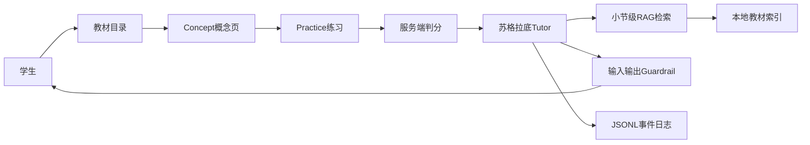

# GenAI Calculus Tutor：项目介绍与面试手册

> 本文用于统一毕业设计、简历和面试口径。  
> 当前项目定位：**已经打通核心学习闭环、可运行和演示的研究型 MVP**，尚未完成面向真实学生的大规模试点与生产化部署。

---

## 1. 推荐项目标题

### 中文标题

**基于 RAG 与苏格拉底式 Agent 的智能微积分辅导系统**

### 英文标题

**RAG-Grounded Socratic Agent for Calculus Tutoring**

### 其他可选标题

- 面向解释驱动学习的微积分智能辅导 Agent
- 基于教材知识库的生成式 AI 微积分助教
- Explain-to-Unlock Calculus Tutor with RAG

推荐优先使用第一个标题，既能说明应用场景，也能突出 RAG 与 Agent 两个主要技术点。

---

## 2. 一句话项目定位

面向 Calculus 1 学习场景，构建“教材概念学习—AI 生成练习—自动判分—苏格拉底式引导”的学习闭环，通过 RAG 提供可追溯的教材依据，并使用 Explain-to-Unlock 策略鼓励学生解释推理，而不是直接获取答案。

---

## 3. 项目背景与研究问题

普通的大模型问答系统很容易直接给出答案和完整解题过程。对于数学学习，这种交互虽然能够快速解决问题，却不一定能促进学生理解“为什么使用这个方法”以及“当前步骤为什么成立”。

本项目研究的核心问题是：

> 能否通过生成式 AI 和苏格拉底式教学策略，要求学生先解释自己的推理，再逐步开放后续提示，从而形成更加重视解释、论证和修正的学习过程？

围绕这个问题，系统设计了两个实验条件：

- `explain`：Explain-to-Unlock。学生需要给出达到要求的解释，系统才推进到下一步。
- `control`：普通渐进式提示。系统不强制要求解释，但仍记录推理质量。

目前项目已经完成实验条件、逐轮日志和分析脚本等基础设施，但**尚未完成正式用户实验，也没有真实学习效果结论**。

---

## 4. 当前系统完整流程

系统面向学生提供三个连续阶段：

1. **Concept**
   - 学生从 MIT Calculus 目录中选择章节和小节。
   - 系统从 Chroma 按 metadata 读取概念、例题、图片和来源页码。

2. **Practice**
   - 系统优先使用能转换为现有题型且答案可验证的教材练习，也可基于当前小节 RAG 生成练习。
   - 支持单选、多选、填空和步骤排序四类题型。
   - 答案保存在后端，前端只接收公开题面。
   - 答错时不立即展示答案，可以重试或进入 Tutor。

3. **Tutor**
   - Agent 结合当前题目、教材检索结果、历史对话和学生推理生成下一步引导。
   - 每轮最多给出一个小提示或一个追问。
   - Explain-to-Unlock 条件下，解释不充分时禁止继续推进。



---

## 5. 技术栈

### 后端与接口

- Python
- FastAPI
- Pydantic
- Uvicorn
- OpenAI-compatible Chat Completions API

### 前端

- Streamlit
- Requests
- LaTeX / Markdown 数学公式渲染
- Streamlit Sortables

### RAG 与数据处理

- Sentence-Transformers
- `all-MiniLM-L6-v2`
- Chroma
- MinerU
- PDF 文本清洗、metadata 过滤与 Top-K 检索

### 测试与分析

- Pytest
- Golden Set
- JSONL 事件日志
- Pandas
- Matplotlib

### 当前未使用的技术

项目目前没有使用：

- LangChain
- LangGraph
- Redis
- MySQL / PostgreSQL
- 模型微调
- BKT / DKT

面试时不要把这些尚未使用的技术写入技术栈。

---

## 6. 当前架构

### 6.1 前后端

- Streamlit 负责教材目录、概念卡、练习、对话和老师视图。
- FastAPI 提供教材目录、概念卡、检索、题目生成、判分和 Tutor 会话接口。
- Pydantic 约束请求、响应和 Agent 结构化状态。

### 6.2 Agent 状态

每个 Tutor 会话保存：

- 当前题目
- 当前教材小节
- `explain / control` 实验条件
- 对话历史
- Hint Level
- Mastery
- 是否已解出
- 最近学生消息
- 连续请求提示次数
- 上一次交互时间

当前会话存储仍然是内存实现，服务重启后会丢失；正式试点前需要迁移到数据库。

---

## 7. RAG 知识库设计

### 7.1 为什么使用分章 PDF

MIT OCW 提供独立章节 PDF，来源清晰并与教材分页对应。系统使用 MinerU 抽取文本和图片，
再结合目录把内容映射到稳定的 `section_id`。PDF 的公式、页眉页脚和跨页内容比 HTML 更难
处理，因此入库前增加基础清洗，并保留 PDF 页码和图片关联供人工核验。

### 7.2 静态教材为什么还要 RAG

教材虽然是静态的，但不能把整本书全部放进一次 LLM 请求。RAG 的作用是：

1. 根据学生当前小节缩小候选范围；
2. 根据具体问题寻找最相关片段；
3. 只把少量片段放入上下文；
4. 返回教材出处。

### 7.3 数据处理流程

```text
MIT Fall 2017 Chapter 1–8 PDF
→ MinerU抽取文本和图片
→ 基础清洗与按section切块
→ concept / example / exercise分类
→ MiniLM生成向量
→ 单一Chroma collection
```

当前知识库覆盖：

- MIT Calculus 第 1–8 章
- 51 个小节
- 1015 个知识片段

每个片段保存：

- `chapter`
- `section_id`
- `title`
- `content_type`
- `order`
- `pdf_page`
- `figure_ids`
- `requires_figure`
- `answer_available`

### 7.4 检索方法

1. 用 `section_id` 和 `content_type` 做 Chroma metadata 过滤；
2. 使用 `all-MiniLM-L6-v2` 生成问题向量；
3. 由 Chroma 选择 Top-K 片段；
5. 注入 Tutor 的 `TEXTBOOK CONTEXT`；
6. 将实际检索来源返回前端。

先做小节过滤的原因是减少跨章节误检。例如学生正在学习 Chain Rule 时，系统不应仅因为问题中出现 derivative 就返回其他导数章节。

### 7.5 如何替换教材

教材层与 Tutor 层已经解耦。更换教材主要需要：

1. 替换教材目录结构；
2. 编写或调整解析器；
3. 重新生成本地快照；
4. 重新切块和计算向量；
5. 保持 `section_id / title / text / source_url` 等统一元数据。

不需要重写 Agent、判分、Guardrail 和前端学习流程。

---

## 8. Concept 概念页

当前 Concept 页根据学生选择的小节，展示：

- 小节标题
- 所属章节
- Key Idea
- Definition
- 教材中的公式或关键内容
- Example
- 官方来源链接

当前概念页主要使用本地教材片段进行确定性抽取，不依赖每次都调用 LLM 生成摘要。这样可以：

- 减少等待时间；
- 降低成本；
- 避免摘要幻觉；
- 在 LLM 不可用时仍能展示教材内容。

局限是 MinerU 文本模式会损失部分复杂公式结构；图片已建立关联，但仍需要持续人工抽查公式、
图注和跨页内容。

---

## 9. AI 出题与服务端判分

### 9.1 支持题型

- 单选题
- 多选题
- 填空题
- 解题步骤排序题

### 9.2 安全设计

- LLM 生成的正确答案只保存在后端 Registry。
- 前端获取的 Pydantic Public Schema 不含答案。
- 提交后由后端规则判分。
- 答错时不返回正确答案。
- 学生可以重试，或者请求 Tutor 提供引导。

### 9.3 当前局限

- 生成题和答案主要依赖 LLM 自检。
- 填空判分以标准化字符串为主。
- 尚未使用 SymPy 验证数学等价性。
- 生成题 Registry 和尝试次数仍保存在内存。

因此不能宣称已经完全解决错题或数学答案验证问题。

---

## 10. 苏格拉底式 Agent

### 10.1 为什么它不只是聊天机器人

系统不是只向 LLM 发送一段 Prompt，而是维护会话状态，并要求每轮返回结构化教学决策：

- `ASSESSMENT`：学生推理质量
- `ACTION`：本轮教学动作
- `ASKS_EXPLANATION`
- `SOLVED`
- `MASTERY_GAIN`
- `MESSAGE`

可选动作包括：

- `probe`
- `hint`
- `correct`
- `affirm`
- `advance`
- `complete`
- `blocked`

后端根据这些动作更新 Hint Level、Mastery 和会话状态。

### 10.2 Explain-to-Unlock

在 `explain` 条件下：

- `none / weak / partial`：继续追问为什么，不开放下一步；
- `adequate / strong`：简短确认，再给下一步小提示；
- 只有学生自己说出正确答案时才标记 solved。

为避免仅靠 Prompt，后端还进行策略校验：

- 如果模型在解释不足时返回 `advance / complete`；
- 服务端强制改为 `probe`；
- 取消 Mastery Gain；
- 要求学生补充理由。

### 10.3 当前局限

- 推理质量仍主要由同一个 LLM 评估；
- Mastery 是启发式分数，不是经过验证的知识追踪模型；
- 还没有人工标注数据验证 assessment 的一致性；
- 还没有完成真实学生的 A/B 实验。

---

## 11. 防剧透与学习真实性验证

### 11.1 输入侧 Guardrail

识别：

- 直接索取最终答案
- 要求跳过过程
- Prompt Injection
- 索取 System Prompt
- 中英文常见变体

### 11.2 输出侧 Guardrail

对 Tutor 回复进行：

- 最终答案匹配；
- 完整解题步骤匹配；
- 命中后执行一次受约束重写；
- 重写仍失败时返回固定安全追问。

### 11.3 Engagement Signal

当前使用轻量规则检测：

- 过快且信息量过低的回答；
- 重复提交相同内容；
- 连续请求 Hint；
- 缺少推理信息的短回答。

命中后不会直接判定学生作弊，而是：

- 暂停增加 Mastery；
- 插入解释验证问题；
- 要求学生用自己的话说明理由。

这是“学习真实性验证”的原型，不代表能够阻止外部搜索、拍照搜题或其他所有作弊方式。

---

## 12. 日志与评测

### 12.1 JSONL 事件

系统记录：

- Session ID
- 实验条件
- 学生消息
- 推理质量
- Agent Action
- 是否要求解释
- Hint Level
- Mastery
- 响应时间
- LLM 延迟
- Guardrail 事件
- Engagement Signal

### 12.2 自动化测试

当前 Pytest 回归测试覆盖：

- 教材目录结构
- 小节查询
- 小节级检索过滤
- Concept 定义和例题提取
- 输入 Guardrail
- 输出答案泄漏
- Explain-to-Unlock 服务端门控
- 答案隐藏与判分

### 12.3 Golden Set

项目包含小型固定样例，覆盖：

- 正常求助
- 直接索答
- 中英文 Prompt Injection
- 正确和错误推理
- 结构化回复解析
- 答案泄漏检测

该评测集目前规模较小，只能用于回归验证，不能作为“系统准确率已经达到某个生产指标”的证据。

---

## 13. 已实现、试验性能力和未实现能力

### 已实现

- FastAPI + Streamlit 完整链路
- 教材目录与小节级 Concept 页面
- MIT PDF 解析产物和 Chroma 语义索引
- Tutor RAG Grounding 与来源引用
- 四类题型生成
- 服务端判分和错误答案隐藏
- Explain-to-Unlock
- 输入和输出双向 Guardrail
- JSONL 日志
- Pytest 与小型 Golden Set

### 试验性实现

- LLM 推理质量评估
- 启发式 Mastery
- Engagement Signal
- Explain / Control 实验条件
- Instructor View

### 尚未实现

- 正式学生试点
- 学习效果统计结论
- 登录、权限与课程名单
- 持久化数据库
- 生产级监控和并发压测
- BKT / DKT
- 人工标注的推理质量评测集
- 模型微调
- 完整教师 Dashboard
- LTI / Learnvia 对接

---

## 14. 后续优化路线

### P0：港大学生试点前必须完成

#### 教材与授权

- 使用导师或学校明确授权的教材材料；
- 或使用教师自行编写的知识卡；
- 删除当前不能用于正式试点的教材快照与索引；
- 保留来源、版本和授权记录。

#### LLM 与数据合规

- 移除当前第三方代理作为生产默认配置；
- 使用港大批准的模型服务、官方企业 API 或校内模型；
- 确认供应商的数据保留和训练策略；
- 禁止将学生数据用于未经批准的模型训练。

#### 隐私和研究伦理

- 使用匿名学生 ID；
- 去除日志中的直接身份信息；
- 明确知情同意、研究用途、保存期限和删除机制；
- 与导师确认伦理审批、豁免或学校流程；
- 将研究日志与普通运行日志分离。

#### 工程化

- 增加登录和访问控制；
- 限制 CORS；
- 会话和题目迁移到数据库；
- 增加请求限流、超时和降级；
- 增加错误监控和审计日志；
- 进行并发和恢复测试。

### P1：学生反馈和学习分析

- “我懂了”
- “我还需要提示”
- “这一步没看懂”
- Hint 有用程度评分
- 标记薄弱知识点
- Misconception 标签
- Verification Question
- 学习进度趋势
- 教师端问题聚合

反馈数据可以用于分析：

- 哪类 Hint 最有效；
- 哪些知识点最容易出现误区；
- Explain-to-Unlock 是否造成过多阻塞；
- 学生在哪个环节退出；
- 不同提示策略对解题过程的影响。

### P2：模型和策略调优

不建议一开始就直接微调大模型，推荐顺序：

1. 建立人工标注评测集；
2. 固定 Baseline；
3. 调整 Chunk Size、Overlap 和 Top-K；
4. 优化 Prompt 和结构化输出；
5. 分离 Tutor 生成和推理质量评估；
6. 使用独立 Judge 或规则交叉验证；
7. 积累足够数据后，再考虑微调小模型。

更适合微调的模块是：

- 推理质量分类；
- Misconception 分类；
- 下一教学动作选择；
- Guardrail 分类。

数学答案正确性不应依赖微调“记住答案”，应优先使用：

- SymPy；
- 数值代入；
- 规则验证；
- 人工题库；
- 独立模型交叉检查。

### P3：个性化与平台集成

- BKT / DKT 学生模型
- 个性化提示强度
- 自适应难度
- 下一题推荐
- 教师 Dashboard
- LTI / Learnvia 集成
- 多模态手写和图片输入

---

## 15. 上线港大学生试点的风险清单

### 教材

当前知识库使用 MIT OCW 提供的 Gilbert Strang *Calculus* Fall 2017 Chapter 1–8 PDF，
按 CC BY-NC-SA 4.0 署名并限制为非商业用途。正式试点前仍应保存教材与条款快照，核对
第三方图片等组件的许可，并确认把检索片段发送给所选 LLM 服务符合适用条款。

### 学生数据

当前系统可能记录学生 ID 和完整对话。真实学生使用前必须完成匿名化、权限控制、保留期限和删除机制。

### LLM 服务

当前开发配置中的第三方 OpenAI-compatible 代理不应处理真实学生数据。部署前必须改为学校批准的服务。

### 研究结论

当前没有足够真实数据证明 Explain-to-Unlock 提升学习效果。正式表述应是“研究假设和实验设计”，不是“已证明有效”。

---

## 16. 面试高频问题与参考回答

以下回答建议控制在 30–60 秒。

### Q1：请介绍一下这个项目

这是我的毕业设计项目，目标是构建一个不会直接给答案、而是引导学生解释推理的微积分辅导 Agent。系统分成 Concept、Practice 和 Tutor 三个阶段。我把教材按章节建立本地 RAG 知识库，练习模块支持四类题型生成和服务端判分，Tutor 会根据学生推理质量选择追问、提示或推进。项目的研究点是 Explain-to-Unlock，即学生解释充分后才开放下一步提示。目前已经完成可运行的研究型 MVP，下一阶段是学生反馈、人工评测集和真实试点前的合规与工程化。

### Q2：为什么这个项目算 Agent，而不是普通聊天机器人

它不仅生成回复，还维护会话状态并执行教学决策。每轮会输出推理质量、教学动作、是否要求解释、是否解决和掌握度变化。后端根据这些结构化结果更新 Hint Level 和 Mastery，并且可以覆盖模型不符合策略的动作。它具备“感知学生输入—选择动作—执行引导—更新状态”的闭环，所以比普通问答更接近任务型 Agent。

### Q3：为什么要使用 RAG

一方面，微积分概念需要教材依据，不能完全依赖模型参数记忆；另一方面，教材内容太长，无法每次全部放入上下文。RAG 先限定当前小节，再做语义 Top-K 检索，只注入相关片段，并把来源返回给前端。这样降低跨章节幻觉，也提高教学内容的可追溯性。

### Q4：为什么没有使用 LangChain 或 LangGraph

当前流程比较明确，主要是教材检索、结构化决策和状态更新。我直接实现这些组件，可以更清楚地控制 Prompt、上下文长度、错误处理和服务端门控，也减少了依赖和抽象开销。如果后续需要多 Agent、复杂分支、人工审批或可恢复工作流，再考虑引入 LangGraph。

### Q5：为什么使用分章 PDF

MIT OCW 提供分章 PDF，便于把抽取结果限制在明确章节并保留教材页码。PDF 的公式、页眉页脚
和跨页段落确实增加了解析难度，因此我用 MinerU 抽取文本与图片，再通过目录映射、基础清洗
和人工校验构建结构化 chunk；运行时不依赖网站。

### Q6：你的 RAG 是怎么实现的

我先按教材目录建立稳定的 section_id，把 MinerU 解析结果清洗并分为 concept、example 和
exercise。使用 all-MiniLM-L6-v2 生成向量，统一写入一个 Chroma collection。检索时先用
section_id 和 content_type 做 metadata 过滤，再返回 Top-K，同时保留 PDF 页码和图片关联。

### Q7：为什么选择 Chroma

本项目不仅需要向量相似度，还需要按章节、内容类型和答案可用性过滤。Chroma 能统一管理
document、embedding、metadata 和 id，避免手工维护 JSON 与向量数组的下标对应关系。MVP 使用
单一 collection，部署仍然简单，也便于后续增加章节或 metadata。

### Q8：Explain-to-Unlock 如何实现

模型先对学生最新回复评估为 none、weak、partial、adequate 或 strong，并选择 probe、hint、advance 等动作。在 explain 条件下，只有 adequate 或 strong 才允许推进。为了避免模型不遵守 Prompt，我在服务端增加了策略校验；解释不足但模型返回 advance 时，后端会强制改为 probe，并取消掌握度提升。

### Q9：如何避免模型直接泄露答案

首先在 System Prompt 中限制不直接给最终答案；其次输入侧拦截直接索答和 Prompt Injection；最后输出侧把回复与最终答案和参考步骤比较。发现泄漏后会进行一次受约束重写，如果仍然命中，就使用固定安全追问。它是多层防护，但不能宣称可以防住所有越狱方式。

### Q10：如何判断学生真的理解了

当前使用推理质量、回答内容、响应耗时、重复回答和连续请求 Hint 等信号。如果学生过快点击“我懂了”或回答信息量过低，系统不会立即增加 Mastery，而会插入反向解释问题。当前属于轻量规则原型，后续需要结合 Verification Question、真实学生反馈和人工标注验证。

### Q11：为什么现在不直接微调模型

微调需要明确任务、大量高质量标注数据和稳定评测集。当前更关键的是先建立 Baseline，优化检索、Prompt、结构化输出和规则，并通过真实试点收集推理质量和教学动作标签。后续更可能微调一个小模型做推理质量或动作分类，而不是微调整个大模型去记数学知识。

### Q12：如何评估这个系统

工程层面使用 Pytest 和 Golden Set，测试目录、检索、策略门控、判分和答案泄漏。RAG 可以看 Hit@K、引用覆盖率和延迟；Agent 可以看结构化解析成功率、动作策略遵循率和答案泄漏率；教学层面最终需要真实学生实验，对比解释质量、完成率、Hint 使用和前后测结果。目前只有前两类基础设施，没有学习效果结论。

### Q13：项目最大的难点是什么

最大的难点不是把 LLM 接到页面，而是控制它的教学行为。单靠 Prompt 很难保证不剧透、解释不足时不推进以及输出结构稳定。因此我把关键策略移到服务端校验，并建立输入、输出双向 Guardrail 和回归测试。另一个难点是让教材目录、检索范围和学生当前学习上下文保持一致。

### Q14：当前最大局限是什么

当前推理质量仍由 LLM 评估，Mastery 是启发式分数；生成题没有完整符号验证；会话存储是内存；还没有真实学生试点和人工标注评测集。上线前还需要处理教材授权、学生隐私、学校批准的模型服务、数据库、鉴权和监控。

### Q15：如果要上线给港大学生，你会先做什么

第一步不是继续堆功能，而是确认教材授权、研究伦理和模型服务合规；然后匿名化学生 ID、增加登录和数据删除机制，将会话迁移到数据库。技术上补齐错误监控、限流、降级和并发测试。完成这些后再进行小规模 Pilot，根据学生和教师反馈迭代。

### Q16：如何更换教材

教材解析和 Tutor 已经解耦。我会把新教材转换成统一的目录和片段元数据，包括 chapter_id、section_id、title、text 和 source_url，然后重新生成向量索引。前端目录、Concept 页面和 Tutor 都继续使用统一 API，不需要重写主流程。

### Q17：如果模型生成了一道错题怎么办

当前通过结构化输出和基础规则降低错误，但还没有彻底解决。下一步会按题型增加验证：符号题使用 SymPy，数值题进行代入检查，选择题检查唯一性，复杂题使用独立 Judge 或人工题库。验证失败的题目不进入学生端，而是重新生成或进入待审核队列。

### Q18：为什么不直接让 LLM 总结整节教材

每次动态总结会增加延迟、成本和幻觉风险。Concept 页目前优先从本地教材中确定性抽取定义、例题和来源；Tutor 才针对学生问题做语义检索。后续可以缓存经过审核的摘要，而不是每次打开页面都重新生成。

---

## 17. 两分钟项目介绍稿

这是我的毕业设计项目，题目是基于 RAG 与苏格拉底式 Agent 的智能微积分辅导系统。它想解决的问题是，普通大模型往往直接给学生答案，但数学学习更需要学生解释为什么使用某个方法。

系统分为三个阶段。Concept 阶段按照教材目录展示当前小节的定义、关键内容、例题和出处；Practice 阶段使用 LLM 生成单选、多选、填空和步骤排序题，并在服务端保存答案和判分；学生遇到困难后进入 Tutor，Agent 会结合当前题目、教材 RAG 和历史对话，一次只给一个提示或追问。

RAG 部分使用 MIT Calculus 第 1–8 章 PDF。我通过 MinerU 抽取并按小节切分，当前覆盖
51 个小节和 1015 个片段，使用 all-MiniLM-L6-v2 生成向量并写入单一 Chroma collection。
检索先按 section_id 和 content_type 过滤，再返回 Top-K、PDF 页码与图片关联。

Agent 的研究点是 Explain-to-Unlock。系统先评估学生推理质量，再选择 probe、hint 或
advance 等教学动作。解释不足时服务端会强制禁止推进，避免完全依赖 Prompt。同时项目还
实现了中英文输入 Guardrail、输出答案泄漏检测、错误答案隐藏、JSONL 日志和自动化测试。

当前定位是可运行的研究型 MVP，还没有正式用户实验。下一阶段会先处理教材授权、学生数据和学校批准的模型服务，再加入学生反馈、人工标注评测集、数据库和教师端学习分析。

---

## 18. 简历版项目介绍

### 推荐标题

**基于 RAG 与苏格拉底式 Agent 的智能微积分辅导系统**

### 技术栈

**Python、FastAPI、Streamlit、OpenAI-compatible API、Sentence-Transformers、Chroma、MinerU、Pydantic、Pytest**

### 图片风格四条版本

- **系统交付：** 面向微积分学习场景，独立完成教材概念学习、AI 出题、服务端判分与多轮辅导模块开发，构建 Concept—Practice—Tutor 端到端学习闭环。
- **RAG 构建：** 解析 MIT Calculus 第 1–8 章，将内容切分为 51 个小节、1015 个带 metadata 的知识片段，基于 MiniLM 与 Chroma 实现小节级 Top-K 检索和引用追溯。
- **Agent 设计：** 实现苏格拉底式多轮辅导 Agent，根据学生推理质量选择追问、提示、纠错或推进动作；设计服务端 Explain-to-Unlock 门控，解释不足时禁止开放下一步。
- **安全评测：** 建立中英文输入、输出双向 Guardrail，拦截直接索答、Prompt Injection 和答案泄漏；使用 JSONL 记录教学动作与行为信号，并通过 Pytest 覆盖核心流程。

### 一页简历精简版

**基于 RAG 与苏格拉底式 Agent 的智能微积分辅导系统**  
**技术栈：** Python、FastAPI、Streamlit、OpenAI-compatible API、Sentence-Transformers、Chroma、Pytest

- 构建“教材概念—AI 出题—自动判分—多轮辅导”学习闭环，实现四类题型生成及服务端判分。
- 将 MIT Calculus 第 1–8 章切分为 51 个小节、1015 个知识片段，基于 MiniLM 与 Chroma 实现 metadata 过滤、RAG 检索和来源追溯。
- 设计苏格拉底式 Agent 与 Explain-to-Unlock 策略，根据学生推理质量选择追问、提示和推进动作。
- 实现中英文 Prompt Injection、直接索答及输出答案泄漏检测，并通过行为信号触发解释验证。

### 偏 AI / Agent 岗版本

- 搭建 RAG 增强型苏格拉底 Agent，将教材按 section_id 进行元数据过滤与语义检索，并向 LLM 注入带引用的 Top-K 教学上下文。
- 设计结构化 Agent Action Schema 与服务端策略门控，根据 reasoning assessment 在 probe、hint、advance 等动作间决策。
- 实现双向 Guardrail、答案泄漏重写、Explain-to-Unlock 与轻量 Engagement Validator，建立 Golden Set 和自动化回归测试。

### 偏软件开发岗版本

- 基于 FastAPI + Streamlit 独立完成智能教学系统的接口设计、前后端联调、会话状态管理和错误处理。
- 设计教材目录、概念卡、出题、判分和 Tutor API，通过 Pydantic 区分内部答案模型与公开响应模型。
- 建立 Chroma 索引、JSONL 日志和自动化测试，支持离线教材检索、行为审计和功能回归。

---

## 19. 简历和面试中可以使用的表述

- 研究型 MVP
- 可运行的端到端原型
- RAG-grounded Tutor
- Explain-to-Unlock 策略
- 服务端策略门控
- 输入、输出双向 Guardrail
- 小节级语义检索
- 实验日志基础设施
- 自动化回归评测
- 计划开展小规模学生试点

---

## 20. 不应使用的夸大表述

不要写：

- 已服务港大学生
- 已证明提升学习效果
- 生产级系统
- 企业级 RAG 平台
- 完全防止作弊
- 模型准确率达到 100%
- 自主训练大模型
- 完成模型微调
- 支持高并发
- 多 Agent 系统
- BKT / DKT 学生建模
- 已完成教师 Dashboard
- 使用 LangChain / LangGraph

除非后续确实实现并有证据，否则这些表述会在面试追问时造成风险。

---

## 21. 推荐的项目口径

### 简历

突出：

- 完整学习闭环
- RAG
- Agent 决策
- Explain-to-Unlock
- 双向 Guardrail
- 测试和可观测性

### 面试

主动说明：

- 当前是研究型 MVP；
- 已经完成哪些核心闭环；
- 哪些指标只是小型评测集；
- 为什么暂时没有微调；
- 上线真实学生前要做哪些合规和工程工作。

### 毕业设计答辩

重点说明：

- 研究问题和实验条件；
- Explain-to-Unlock 的理论动机；
- 系统如何记录解释、论证和修正；
- 后续如何使用学生反馈验证教学效果。

---

## 22. 最终推荐简历版本

> **基于 RAG 与苏格拉底式 Agent 的智能微积分辅导系统**  
> **技术栈：** Python、FastAPI、Streamlit、OpenAI-compatible API、Sentence-Transformers、Chroma、MinerU、Pydantic、Pytest  
> - 构建“教材概念—AI 出题—自动判分—多轮辅导”端到端学习闭环，实现四类题型生成与服务端判分。  
> - 将 MIT Calculus 第 1–8 章切分为 51 个小节、1015 个知识片段，基于 MiniLM 与 Chroma 实现 metadata 过滤、RAG 检索与来源追溯。  
> - 设计苏格拉底式 Agent 与 Explain-to-Unlock 服务端门控，根据学生推理质量选择追问、提示、纠错或推进动作。  
> - 实现中英文输入、输出双向 Guardrail 和行为信号验证，并使用 JSONL 与自动化测试覆盖核心教学流程。

