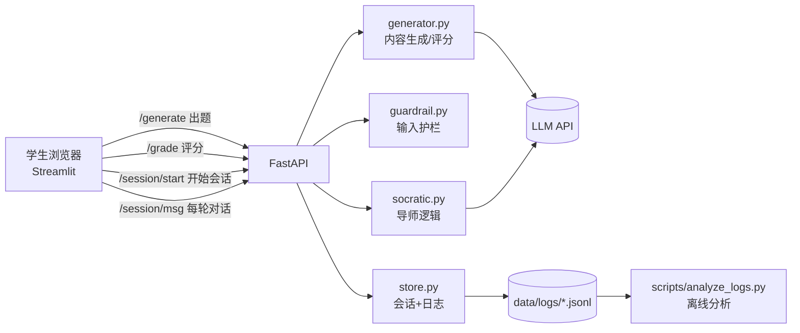
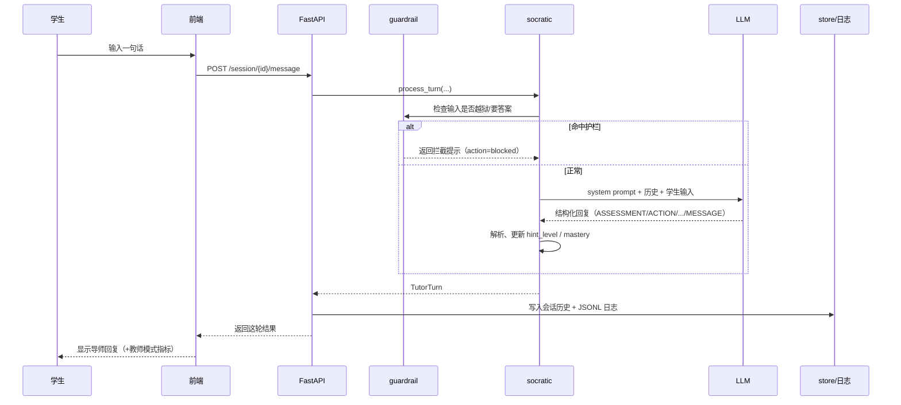

# 系统设计说明（Demo 代码架构）

面向汇报：说明当前 demo 的整体架构、各模块职责、数据流、以及关键设计决策。
代码仓库：https://github.com/GloriaSY01/GenAI_Calculus_Tutor

---

## 一、系统概览

一句话：**一个用 FastAPI（后端）+ Streamlit（前端）搭建的微积分学习系统**，包含三块能力——AI 出题、苏格拉底式导师、学生交互与日志。

### 技术栈

| 层 | 技术 | 说明 |
| --- | --- | --- |
| 前端 | Streamlit | 单页应用，左右两块布局，学生/教师两种视图 |
| 后端 | FastAPI | 提供出题、评分、会话、对话等 REST 接口 |
| 大模型 | OpenAI 兼容 API（yunwu.ai 代理） | 用于出题与导师对话 |
| 存储 | 内存 + JSONL 日志 | 会话存内存；每轮交互落盘为日志，供离线分析 |

### 三大模块 ↔ 代码对应

| 设计文档模块 | 代码位置 | 职责 |
| --- | --- | --- |
| 2.1 学习内容生成 | `backend/generator.py` | 用 LLM 生成 4 种题型 + 自动评分 |
| 2.2 AI Agent（苏格拉底导师） | `backend/socratic.py`、`backend/guardrail.py` | 引导式对话、不剧透、explain-to-unlock |
| 2.3 学生-系统交互 | `frontend/streamlit_app.py`、`backend/store.py` | UI 交互、防越狱、日志埋点 |

---

## 二、目录结构

```
GenAI_Calculus_Tutor/
├── backend/
│   ├── main.py         # FastAPI 入口，定义所有 API
│   ├── config.py       # 读取 .env（API key / model / 路径）
│   ├── schemas.py      # Pydantic 数据模型（请求/响应/内部状态）
│   ├── llm.py          # LLM 调用封装 + 稳健 JSON 解析
│   ├── guardrail.py    # 输入护栏（防越狱 / 防要答案）
│   ├── socratic.py     # 苏格拉底导师核心逻辑
│   ├── generator.py    # 内容生成 + 自动评分 + 转 Problem
│   ├── problems.py     # 加载静态题库
│   └── store.py        # 会话存储 + JSONL 日志
├── frontend/
│   └── streamlit_app.py# 前端页面（练习块 + 导师块）
├── data/
│   ├── problems.json   # 预置题库
│   └── logs/           # 每个会话一个 .jsonl 日志
├── scripts/            # 测试与分析脚本
└── reports/            # 日志分析产出（如 condition_summary.csv）
```

---

## 三、整体数据流



**一次导师对话的完整链路**：



---

## 四、后端模块详解

### 4.1 config.py — 配置
从项目根目录 `.env` 读取 `LLM_BASE_URL / LLM_API_KEY / LLM_MODEL`，并统一管理 `data/`、`data/logs/`、`problems.json` 路径。默认模型 `gpt-4o-mini`。

### 4.2 schemas.py — 数据契约
用 Pydantic 定义所有请求/响应模型，保证前后端字段一致。两个关键设计：
- **答案隔离**：`Problem`（含 `final_answer / key_idea / solution_steps`，仅后端用）与 `ProblemPublic`（发给前端，无答案）分开；生成题同理有 `GeneratedQuestionPublic`（不含答案）。
- **两个枚举**：`Condition = explain | control`（实验条件）、`QuestionType = single_choice | multiple_choice | fill_blank | drag_order`（四种题型）。

### 4.3 llm.py — 大模型封装
- `chat()`：调用 chat completion，带重试；若代理不支持 `response_format` 会自动去掉再试。
- `chat_to_json()`：不强制 JSON 模式地拿 JSON（对含 LaTeX 的输出更稳）。
- `_extract_json()` + `_repair_backslashes()`：从模型回复里稳健抽取 JSON，并把 LaTeX 里非法的单反斜杠（如 `\frac`）自动加倍，避免 `json.loads` 报错。**这是踩过坑后加的容错**。

### 4.4 guardrail.py — 输入护栏
用正则匹配两类风险输入并拦截（对应 2.3 的防越狱）：
- **prompt injection**：如 "ignore previous instructions"、"you are now…"。
- **直接要答案**：如 "just give me the answer"、"solve it for me"。
命中后不调用 LLM，直接返回一段"我不会直接给答案，但可以引导你"的话术（`action=blocked`）。

### 4.5 socratic.py — 苏格拉底导师（核心）
见第五节详解。

### 4.6 generator.py — 内容生成与评分
见第六节详解。

### 4.7 problems.py — 静态题库
从 `data/problems.json` 加载预置题目（带 `lru_cache`），提供列表/按 id 查询/转 public 视图。

### 4.8 store.py — 会话与日志
- 用内存字典存 `Session`（含历史、hint_level、mastery、turns 等）。
- 每次 `session_start` 和每一轮 `turn` 都追加写入 `data/logs/<session_id>.jsonl`，作为学习分析的原始数据。

### 4.9 main.py — API 入口
把上述模块串成 REST 接口（见第八节 API 一览）。

---

## 五、苏格拉底导师设计（socratic.py）

### 5.1 核心思想：explain-to-unlock
研究亮点。系统支持两种教学策略（实验条件）：

| | explain 组（实验组） | control 组（对照组） |
| --- | --- | --- |
| 策略 | 学生必须先解释推理，达标才推进 | 给渐进提示，不强制解释即可推进 |
| 解释弱时 | 追问"为什么"，**不推进** | 直接给下一步提示 |
| 是否记录推理/掌握度 | 记 | **也记**（同一把尺子，保证可比） |
| 是否剧透答案 | 都不剧透 | 都不剧透 |

**唯一差别只有"要不要逼学生解释"这一个变量** → 便于做对照实验，把学习增益归因到"解释"本身。对应代码里的 `_EXPLAIN_POLICY` 与 `_CONTROL_POLICY`。

### 5.2 硬规则（system prompt 内置）
- 绝不给出最终答案或完整解法；
- 每次只给一个小步骤或一个引导问题；
- 参考答案仅用于决定"下一步问什么"，绝不粘贴；
- 用 `$...$` / `$$...$$` 写数学，保证渲染。

### 5.3 结构化输出（关键工程决策）
让模型按**行式键值格式**输出，而不是 JSON（因为 LaTeX 反斜杠会破坏 JSON）：

```
ASSESSMENT: <none|weak|partial|adequate|strong>   # 学生这轮推理质量
ACTION: <probe|hint|correct|affirm|advance|complete>  # 导师动作
ASKS_EXPLANATION: <yes|no>
SOLVED: <yes|no>                                   # 学生是否自己说出正确答案
MASTERY_GAIN: <yes|no>                             # 这轮是否有真实进展
MESSAGE: <给学生看的话，含 LaTeX>
```

`MESSAGE:` 之后（含换行）全部作为学生可见内容，从而**完整保留 LaTeX 反斜杠**。`_parse_response()` 负责解析这种格式。

### 5.4 一轮处理流程 `process_turn()`
1. **护栏检查**：命中则直接返回拦截提示。
2. **拼上下文**：system prompt + 历史对话 + 学生输入。
3. **调用 LLM + 解析**：解析出 `ASSESSMENT / ACTION / SOLVED / MASTERY_GAIN / MESSAGE`。
4. **更新状态**：
   - `hint_level`：动作是 hint/advance/correct 时 +1；
   - `mastery`：有进展 +10，学生自己解出 +25，封顶 100。
5. 返回 `TutorTurn`（教师模式显示的那几个字段就来自这里）。

---

## 六、内容生成与自动评分（generator.py）

### 6.1 四种题型
统一用一个 `_BASE` 提示词 + 每种题型的 `_SPECS`（规定输出 JSON 结构）：

| 题型 | 关键字段 | 评分方式 |
| --- | --- | --- |
| single_choice 单选 | options + correct_index | 所选下标∈正确集 |
| multiple_choice 多选 | options + correct_indices | 所选集合==正确集合 |
| fill_blank 填空 | 每空 answer + alternatives | 每空归一化后命中可接受答案 |
| drag_order 拖拽排序 | 正确顺序 steps（前端打乱展示） | 归一化后顺序完全一致 |

### 6.2 答案不下发（安全设计）
生成的完整题目（含答案）存在**服务端内存注册表 `_REGISTRY`**，前端只拿到 `GeneratedQuestionPublic`（无答案）。学生提交答案后走 `/grade` **在服务端判分**，前端拿不到正确答案，除非判分后由后端返回。

### 6.3 数学记号约定（踩坑后的对策）
`_BASE` 明确要求模型在 `$...$` 里用**无反斜杠**记号（`x^2`、`sqrt(x)`、`(x+1)/(x-1)`），避免 LaTeX 反斜杠破坏 JSON 解析。

### 6.4 与导师联动 `to_problem()`
把一道生成题转换成导师可用的 `Problem` 对象（拼出题面、选项/步骤，带上 key_idea 和 solution_steps 作为私有参考）。这就是前端"把左侧题目关联到右侧导师"按钮背后的桥接。

---

## 七、前端设计（streamlit_app.py）

### 7.1 两块布局
- **左块 Practice**：选知识点/题型/难度 → 生成题目 → 作答 → 提交判分。四种题型有各自控件（单选 radio、多选 checkbox、填空 text、拖拽排序用 `streamlit-sortables`）。
- **右块 Tutor**：默认自由聊天；可用按钮把左侧题目"关联"进来，也可"解除关联"回到自由聊天。

### 7.2 学生视图 vs 教师视图
- 默认（普通网址）= 学生视图：只显示进度条。
- 网址加 `?instructor=1` = 教师调试视图：额外显示 `Condition / Mastery / Hint level / Reasoning / session_id`，用于开发调试、核对"内部状态↔学生反馈"是否对齐、以及区分实验条件。
- 二者是**同一页面的两种显示模式**，不是两个实时联动的客户端；教师看学生数据走的是日志离线分析。

---

## 八、API 一览

| 方法 | 路径 | 作用 |
| --- | --- | --- |
| GET | `/health` | 健康检查 + 模型信息 |
| GET | `/topics` | 返回知识点列表 |
| GET | `/problems` | 静态题库（无答案） |
| POST | `/generate` | 生成一道题（返回无答案版本） |
| POST | `/grade` | 提交答案，服务端判分 |
| POST | `/session/start` | 开始会话（可绑定题目或自由聊天） |
| POST | `/session/{id}/message` | 发送学生消息，返回导师这一轮结果 |
| GET | `/session/{id}` | 查询当前会话状态 |

---

## 九、数据与实验分析

- **日志格式**：`data/logs/<session_id>.jsonl`，每行一条事件。
  - `session_start`：problem_id、condition、student_id、时间戳。
  - `turn`：turn_index、student_text、latency_ms，以及 reasoning_assessment / action / hint_level / mastery / is_solved。
- **分析脚本**：
  - `scripts/seed_sessions.py`：造样例会话；
  - `scripts/analyze_logs.py`：把日志按 explain/control 汇总成对比报告（如 `reports/condition_summary.csv`）；
  - `scripts/test_generation.py`、`smoke_test.py`、`api_test.py`：生成/判分与端到端流程测试。

---

## 十、关键设计决策（可作为汇报亮点）

1. **答案与题面分离**：`Problem` vs `ProblemPublic`，生成题存服务端注册表，判分在后端——防止前端泄题。
2. **行式结构化输出替代 JSON**：导师回复用 `KEY: value` + `MESSAGE:` 格式，绕开 LaTeX 反斜杠破坏 JSON 的问题；`llm.py` 另有 `_repair_backslashes` 兜底。
3. **explain/control 双条件同尺度测量**：control 组也照常打分，只是不拿解释当推进门槛，保证两组指标可比——为实验设计打底。
4. **内部状态标签显式化**：reasoning/hint/mastery/solved 既驱动教学动作，又通过教师模式暴露，直接回应导师"状态标签与反馈对齐"的建议。
5. **全流程日志埋点**：每轮交互结构化落盘，为学习分析和实证研究提供原料。
6. **轻量护栏**：正则拦截"要答案/越狱"，命中不调用 LLM，稳定且省成本。

---

## 十一、现状与局限（下一步）

| 现状 | 局限 / 下一步 |
| --- | --- |
| 能生成 4 题型、自动判分 | **内容验证器缺失**：偶有选项正确性/填空数不一致 → 下阶段加规则 + SymPy/CAS + RAG 校验、不通过重生成 |
| 导师能引导、不剧透 | 对话状态可更稳定；拟接 RAG 让引导"有出处" |
| 已有结构化日志 | 指标计算脚本待完善，形成完整 Learning Analytics |
| 支持 explain/control | 正式实验方案（RQ/假设/指标/分析计划）待成文 |
| 会话存内存 | 重启即丢；后续可换持久化存储 |

---

*小结：demo 已把三大模块（内容生成 / 苏格拉底导师 / 学生交互）端到端打通，工程上处理了 LaTeX-JSON 冲突、答案隔离、结构化日志等关键问题，并为后续内容验证与实验评估预留了接口。*
